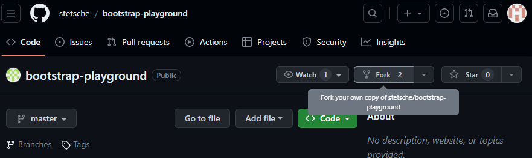

# Bootstrap Playground

## Getting started
### Installing the required programms

First of you need to install some programms:
- NodeJS (https://nodejs.org/en/download)
- Github Desktop (https://desktop.github.com) or Git (https://git-scm.com/downloads)
Other optional programms I recommend:
- VisualStudio Code (https://code.visualstudio.com/download)
- a nice Browser (not Internet Explorer or Microsoft Edge)

After downloading and installing everything, you want to go to the [boostrap-playground repository](https://github.com/SirSaibot/bootstrap-playground) (https://github.com/SirSaibot/bootstrap-playground) and in the top-right click on the Fork button.

The the page that opens you can change the owner, name and description but I recommend to leave everything as it is and press create fork.
After a few seconds it should be done, now you can look at your own repositories and there should be a new one named bootstrap-tutorial (if you didnt change the name).

If you installed Github Desktop you can skip the following tutorial on how to start with Git.

## Git

## GithubDesktop